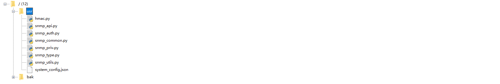

# QuecPython SNMP Client Documentation

### Introduction to SNMP

- `snmp` (Simple Network Management Protocol) is implemented and applied using a special `C/S` model: the agent/manager model.
- An agent refers to a network device that provides SNMP services, capable of offering network status and configuration information, and can send network event alarms to the manager, responding to various requests from the network.
- The manager acts like a client, requesting data returns from different agents.
- The protocol communicates via `UDP` ports 161 (agent port) and 162 (manager trap process open port).
- Agents provide a multitude of Object Identifiers (`OIDs`). An `OID` is a unique key-value pair, each corresponding to different system information.
- `OIDs` are typically long, making them difficult to remember. Thus, a method was designed to translate numerical `OIDs` into a human-readable format, with translation mappings saved in the "Management Information Base" (`MIB`), an unformatted text file.
- `snmp` has two ways of data interaction: request and `trap`. A request refers to the manager sending a `GET` request to the agent device to obtain relevant network information, which is a proactive form of network monitoring. `Trap` refers to configuring an agent to actively send an alarm to the manager when a specific event is detected.
- There are three common versions: `SNMPv1`, `SNMPv2c`, and `SNMPv3`, where `SNMPv1` and `SNMPv2c` are widely used. However, due to the insecure nature of these protocols, they are typically used for read-only access. `SNMPv3` is a secure communication protocol, where `v1` and `v2c` use the same community string authentication parameter (default is `public`, which needs to be modified in production environments), and `v3` uses a user account password-based authentication method.

### Building SNMP Services

This document demonstrates the installation and configuration of SNMP services using the Ubuntu 18.04 system.

#### Software Dependencies

- `snmpd`: SNMP server software, providing open ports for returning data (system status information, etc.) requested by the client.
- `snmp`: SNMP client software, used to send requests to the server to obtain the system status information.
- `snmp-mibs-downloader`: Software used to download and update the local `mib` library.

Execute the following command, which will install a series of SNMP-related tools, such as `snmpwalk`, `net-snmp-create-v3-user`, `snmptranslate`, etc.

```shell
$ sudo apt install snmp snmpd snmp-mibs-downloader libsnmp-dev
```

#### Basic Configuration and Operation

Check the `snmpd` status:

```shell
$ sudo systemctl status snmpd
```

Configure the management `MIB` library:

Update the `mib` library on the agent side; updated agent library information can be viewed in `/var/lib/snmp/mibs` or `/var/lib/mibs`.

```shell
$ sudo download-mibs
```

Enable the translation of `MIB` database `OIDs` to readable strings, by commenting out the last line `mibs`:

```shell
$ sudo vim /etc/snmp/snmp.conf
mibs:
Change to
# mibs:
```

View the `MIB` library's `OID` mapping relationship:

```shell
$ snmptranslate -Tz                
"org"            "1.3"
"dod"            "1.3.6"
"internet"            "1.3.6.1"
"directory"            "1.3.6.1.1"
"mgmt"            "1.3.6.1.2"
"mib-2"            "1.3.6.1.2.1"
"system"            "1.3.6.1.2.1.1"
"sysDescr"            "1.3.6.1.2.1.1.1"
"sysObjectID"            "1.3.6.1.2.1.1.2"
"sysUpTime"            "1.3.6.1.2.1.1.3"
"sysUpTimeInstance"            "1.3.6.1.
...
```

When executing the SNMP collection program, the program queries the `MIB` file at a fixed location. If it exists, it is translated. Therefore, if you have custom `MIB` files, simply placing them in the specified location can obtain the translated query. The default `MIB` file location is as follows:

```shell
$ snmpwalk --help
  -M DIR[:...]          look in given list of directories for MIBs
    (default: $HOME/.snmp/mibs:/usr/share/snmp/mibs:/usr/share/snmp/mibs/iana:/usr/share/snmp/mibs
```

#### Testing Basic Information Retrieval

##### snmp1 and snmpv2c

`snmpwalk` is a tool additionally installed when installing SNMP services, used to test SNMP service access.

The `-v` parameter is used to specify the version.

The `-c` parameter specifies the community string authentication parameter. Since the default is `public`, you can use this parameter directly.

`localhost` specifies the agent server address. Since the agent and manager are installed on the same machine, use `localhost` as the agent's address.

`.1.3.6.1.2.1.1.1` represents the `OID` parameter information, which indicates system host information.

The output of the following two commands is the same:

```shell
$ snmpwalk -v 1 -c public localhost .1.3.6.1.2.1.1.1
$ snmpwalk -v 2c -c public localhost .1.3.6.1.2.1.1.1
SNMPv2-MIB::sysDescr.0 = STRING: Linux gong 5.15.0-48-generic #203-Ubuntu SMP Wed Aug 10 17:40:03 UTC 2022 x86_64
```

If you want to retrieve more information, you need to shorten the `OID` parameter.

For example, change it to `.1.3.6.1.2`, and more data is retrieved. SNMP retrieves information using a prefix matching format; the shorter the specified `OID`, the more matching information.

```shell
$ snmpwalk -v 1 -c public localhost .1.3.6.1.2
SNMPv2-MIB::sysDescr.0 = STRING: Linux gong 5.15.0-48-generic #203-Ubuntu SMP Wed Aug 10 17:40:03 UTC 2022 x86_64
SNMPv2-MIB::sysObjectID.0 = OID: NET-SNMP-MIB::netSnmpAgentOIDs.10
DISMAN-EVENT-MIB::sysUpTimeInstance = Timeticks: (234221) 0:39:02.21
SNMPv2-MIB::sysContact.0 = STRING: Me <me@example.org>
SNMPv2-MIB::sysName.0 = STRING: gong
SNMPv2-MIB::sysLocation.0 = STRING: Sitting on the Dock of the Bay
SNMPv2-MIB::sysServices.0 = INTEGER: 72
SNMPv2-MIB::sysORLastChange.0 = Timeticks: (0) 0:00:00.00
SNMPv2-MIB::sysORID.1 = OID: SNMP-FRAMEWORK-MIB::snmpFrameworkMIBCompliance
SNMPv2-MIB::sysORID.2 = OID: SNMP-MPD-MIB::snmpMPDCompliance
SNMPv2-MIB::sysORID.3 = OID: SNMP-USER-BASED-SM-MIB::usmMIBCompliance
SNMPv2-MIB::sysORID.4 = OID: SNMPv2-MIB::snmpMIB
SNMPv2-MIB::sysORID.5 = OID: SNMP-VIEW-BASED-ACM-MIB::vacmBasicGroup
SNMPv2-MIB::sysORID.6 = OID: TCP-MIB::tcpMIB
SNMPv2-MIB::sysORID.7 = OID: UDP-MIB::udpMIB
SNMPv2-MIB::sysORID.8 = OID: IP-MIB::ip
SNMPv2-MIB::sysORID.9 = OID: SNMP-NOTIFICATION-MIB::snmpNotifyFullCompliance
SNMPv2-MIB::sysORID.10 = OID: NOTIFICATION-LOG-MIB::notificationLogMIB
SNMPv2-MIB::sysORDescr.1 = STRING: The SNMP Management Architecture MIB.
SNMPv2-MIB::sysORDescr.2 = STRING: The MIB for Message Processing and Dispatching.
SNMPv2-MIB::sysORDescr.3 = STRING: The management information definitions for the SNMP User-based Security Model.
SNMPv2-MIB::sysORDescr.4 = STRING: The MIB module for SNMPv2 entities
SNMPv2-MIB::sysORDescr.5 = STRING: View-based Access Control Model for SNMP.
SNMPv2-MIB::sysORDescr.6 = STRING: The MIB module for managing TCP implementations
SNMPv2-MIB::sysORDescr.7 = STRING: The MIB module for managing UDP implementations
SNMPv2-MIB::sysORDescr.8 = STRING: The MIB module for managing IP and ICMP implementations
SNMPv2-MIB::sysORDescr.9 = STRING: The MIB modules for managing SNMP Notification, plus filtering.
SNMPv2-MIB::sysORDescr.10 = STRING: The MIB module for logging SNMP Notifications.
SNMPv2-MIB::sysORUpTime.1 = Timeticks: (0) 0:00:00.00
SNMPv2-MIB::sysORUpTime.2 = Timeticks: (0) 0:00:00.00
SNMPv2-MIB::sysORUpTime.3 = Timeticks: (0) 0:00:00.00
SNMPv2-MIB::sysORUpTime.4 = Timeticks: (0) 0:00:00.00
SNMPv2-MIB::sysORUpTime.5 = Timeticks: (0) 0:00:00.00
SNMPv2-MIB::sysORUpTime.6 = Timeticks: (0) 0:00:00.00
SNMPv2-MIB::sysORUpTime.7 = Timeticks: (0) 0:00:00.00
SNMPv2-MIB::sysORUpTime.8 = Timeticks: (0) 0:00:00.00
SNMPv2-MIB::sysORUpTime.9 = Timeticks: (0) 0:00:00.00
SNMPv2-MIB::sysORUpTime.10 = Timeticks: (0) 0:00:00.00
HOST-RESOURCES-MIB::hrSystemUptime.0 = Timeticks: (451727) 1:15:17.27
HOST-RESOURCES-MIB::hrSystemDate.0 = STRING: 2022-9-25,11:0:56.0,+8:0
HOST-RESOURCES-MIB::hrSystemInitialLoadDevice.0 = INTEGER: 393216
HOST-RESOURCES-MIB::hrSystemInitialLoadParameters.0 = STRING: "BOOT_IMAGE=/vmlinuz-5.15.0-48-generic root=UUID=ef5920a3-64eb-4d3f-b794-156d2d97cef9 ro quiet splash vt.handoff=7
"
HOST-RESOURCES-MIB::hrSystemNumUsers.0 = Gauge32: 2
HOST-RESOURCES-MIB::hrSystemProcesses.0 = Gauge32: 461
HOST-RESOURCES-MIB::hrSystemMaxProcesses.0 = INTEGER: 0
End of MIB
```

Data Explanation

The main format is `SNMPv2-MIB::{OID[readable string]}.{division point, starting from 0} = {data format}: {data information}`

```shell
SNMPv2-MIB::sysDescr.0 = STRING: Linux gong 5.15.0-48-generic #203-Ubuntu SMP Wed Aug 10 17:40:03 UTC 2022 x86_64
```

##### snmp3

Since `v3` uses a user-based authentication method, you need to create a test user for authentication first.

Stop the `snmpd` service during the user creation process.

```shell
$ sudo systemctl stop snmpd
```

The command format for creating a user is as follows; `net-snmp-create-v3-user` is provided by the `libsnmp-dev` package installed with the software.

```shell
$ net-snmp-create-v3-user [-ro] [-A authpass] [-X privpass] [-a MD5|SHA|SHA-512|SHA-384|SHA-256|SHA-224] [-x DES|AES] [username]
```

The `-ro` parameter indicates that the user is read-only.

The `-A` specifies the user passphrase, at least 8 characters, used to generate the authentication key.

The `-X` at least 8 characters, used to generate the encryption key.

The `-a` specifies the user authentication type, which uses different algorithms for computation.

The `-x` specifies the encryption validation type.

Create a user as follows, using the authentication parameter `authtest`, the authentication encryption algorithm `MD5`, the encryption parameter `privtest`, the encryption algorithm `AES`, and the specified user name `quectel`.

```shell
$ sudo net-snmp-create-v3-user -ro -A authtest -a MD5 -X privtest -x AES quectel
adding the following line to /var/lib/snmp/snmpd.conf:
   createUser quectel MD5 "authtest" AES "privtest"
adding the following line to /usr/share/snmp/snmpd.conf:
   rouser quectel
```

Check the modified files according to the prompts.

```shell
$ cat /var/lib/snmp/snmpd.conf
# Discover the last line is the authentication information just written
...
createUser quectel MD5 "authtest" AES "privtest"
$ cat /usr/share/snmp/snmpd.conf
# The last line is as follows
rouser quectel
```

Restart the service and verify.

Specify the version in the parameters, the user name, the authentication algorithm `MD5`, the authentication parameter `authtest`, the encryption algorithm `AES`, the encryption parameter `privtest`.

```
-l`specifies the security level, with optional parameters`noAuthNoPriv`,`authNoPriv`,`authPriv`. Since the created user specified both authentication and encryption, the parameter is now filled in as `authPriv`.
```

Since the `MIB` library exists, the `OID` parameter can also pass a readable string.

```shell
$ sudo systemctl restart snmpd
$ snmpwalk -v 3 -u quectel -a MD5 -A authtest -x AES -X privtest -l authPriv localhost sysDescr
```

#### Access Information Scope Control

Sometimes we need to get some information, but we find that we can't get it when executing the command, although we know there should be this information.

For example, we now need to obtain network card information.

Execute the following command; the network card information corresponds to the `OID` `.1.3.6.1.2.1.31.1.1.1.1` or `ifName`.

```shell
$ snmpwalk -v 2c -c public localhost .1.3.6.1.2.1.31.1.1.1.1
IF-MIB::ifName = No more variables left in this MIB View (It is past the end of the MIB tree)
```

This is mainly because the configuration file restricts the information that the agent can return. Modify `/etc/snmp/snmpd.conf`.

```shell
# Find the following two configuration lines and comment them out
view   systemonly  included   .1.3.6.1.2.1.1
view   systemonly  included   .1.3.6.1.2.1.25.1

# Add a line, do not open too much information, need to actually open as needed
view   systemonly  included   .1.3.6.1.2.1.31.1.1.1.1

# Or you can just add a line to save trouble, which opens all the information, but you need to be careful in a production environment
view   systemonly  included   .1
```

Restart the service.

```shell
$ sudo systemctl restart snmpd
```

Execute the command, check the output, and find that the data is successfully retrieved.

```shell
$ snmpwalk -v 2c -c public localhost .1.3.6.1.2.1.31.1.1.1.1
IF-MIB::ifName.1 = STRING: lo
IF-MIB::ifName.2 = STRING: enp3s0
IF-MIB::ifName.3 = STRING: wlp4s0
```

#### snmp1, snmp2c Configure Community Authentication Parameters

Modify `/etc/snmp/snmpd.conf`, where the default authentication parameter is `public`. This parameter, being default, public, and insecure, needs to be changed to another parameter.

```shell
# Modify the following
rocommunity  public default -V systemonly
rocommunity6 public default -V systemonly
# Change to
rocommunity  changed default -V systemonly
rocommunity6 changed default -V systemonly
```

Restart the service.

```shell
$ sudo systemctl restart snmpd
```

Test using the `public` authentication parameter, finding no response.

```shell
$ snmpwalk -v 2c -c public localhost .1.3.6.1.4.1.2021
Timeout: No Response from localhost
```

Test using the `changed` parameter, which can be used normally.

```shell
$ snmpwalk -v 2c -c changed localhost sysDesc
SNMPv2-MIB::sysDescr.0 = STRING: Linux quectel 5.15.0-48-generic #203-Ubuntu SMP Wed Aug 10 17:40:03 UTC 2022 x86_64
```

#### Open Service Remote Access

Check the port opening, finding that only local access is possible.

```shell
$ sudo netstat -anp |grep 161
udp        0      0 127.0.0.1:161           0.0.0.0:*                           210652/snmpd        
udp6       0      0 ::1:161                 :::*                                210652/snmpd   
```

Modify `/etc/snmp/snmpd.conf`.

```shell
# Comment out
agentaddress  127.0.0.1,[::1]
# Modify
agentAddress udp:161,udp6:[::1]:161
```

Check the port after restarting the service.

```shell
$ sudo netstat -antup |grep 161
udp        0      0 0.0.0.0:161             0.0.0.0:*           106387/snmpd        
udp6       0      0 ::1:161                 :::*                106387/snmpd 
```

### Module Client Debugging

Download the SNMP code and upload it to the module.



SNMP V2

```python
>>> from usr.snmp_api import Client, V2C # Import the library file
>>> 
>>> client = Client("0.0.0.0", V2C("public"), port=161)  # Create an instance
>>> client.get("1.3.6.1.2.1.1.1.0")  # Command request
GetResponse(1720144440, [VarBind(oid=ObjectIdentifier(value = 1.3.6.1.2.1.1.1.0), value=OctetString(value = b'Linux iZuf642p5ypuu6vbfpzae7Z 4.15.0-192-generic #203-Ubuntu SMP Wed Aug 10 17:40:03 UTC 2022 x86_64'))])
>>> 
```

SNMP V3

V3 version provides client encryption and authentication suites, currently lacking algorithm support (in iteration), only supports authentication, authentication needs to be specified during Client initialization.

```python
>>> from usr.snmp_common import Auth
>>> from usr.snmp_api import Client, V3
>>>
>>> client = Client("0.0.0.0", V3("quectel", auth=Auth(b'authtest', "md5")), port=161)
>>> client.get("1.3.6.1.2.1.1.1.0")
GetResponse(1720144800, [VarBind(oid=ObjectIdentifier(value = 1.3.6.1.2.1.1.1.0), value=OctetString(value = b'Linux iZuf642p5ypuu6vbfpzae7Z 4.15.0-192-generic #203-Ubuntu SMP Wed Aug 10 17:40:03 UTC 2022 x86_64'))])
>>> 
```

For more command sample code, refer to the [API Documentation](./API_Reference.md).

