# QuecPython SNMP Agent Documentation

## Introduction

This document introduces how to run the tracker solution program we provided on modules or devices. The operations demonstrated in this document are based on Quectel EG915U series module.

## Get Resource

Resources can be downloaded from: https://github.com/QuecPython/snmp

## Set up Environment

### Install USB Driver

Please download and install the driver according to the platform of the module to be debugged. [Click here to download USB Drivers](https://python.quectel.com/en/download)

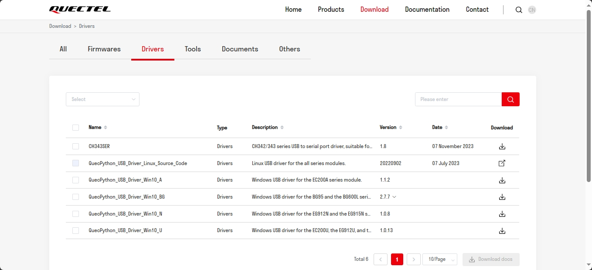

### Download Development and Debugging Tool

It is recommended to use QPYcom for development and debugging. The processes described in this document are under the premise that QPYcom is used and USB driver installation is successful.

[Click here to download QPYcom](https://python.quectel.com/en/download)

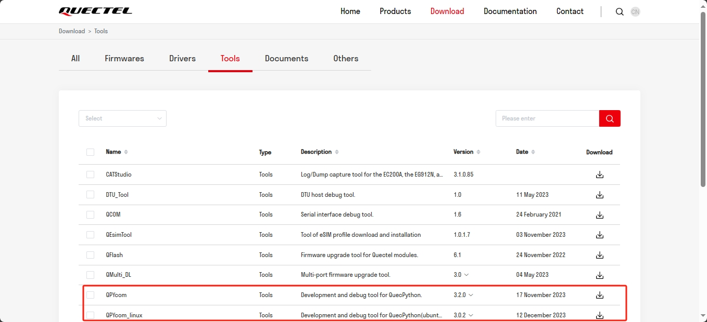

[Click here to view QPYcom User Guide](https://python.quectel.com/doc/Application_guide/en/dev-tools/QPYcom/index.html)

### Download Firmware

Download the corresponding QuecPython firmware according to the current debugging module model from the QuecPython official website, and download the firmware into the module with QPYcom.

[Click here to download firmware](https://python.quectel.com/en/download)

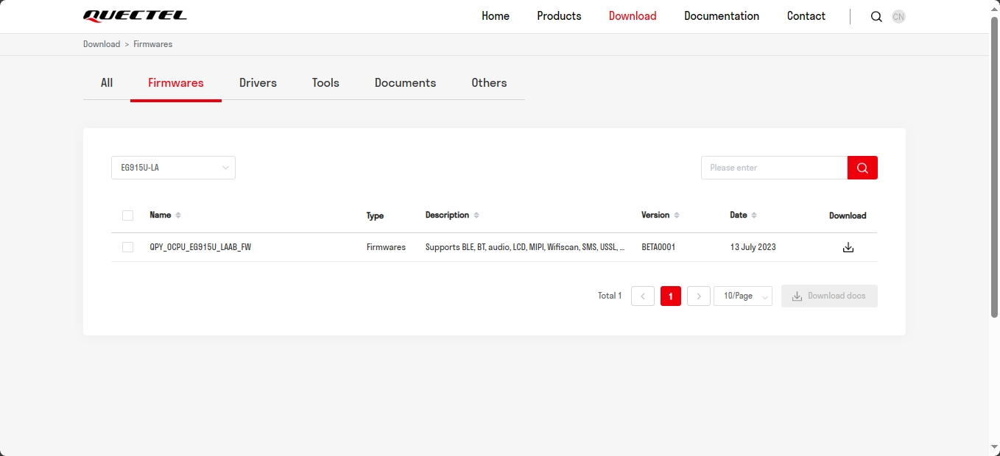

Use QPYcom to download firmware.

1. Select firmware

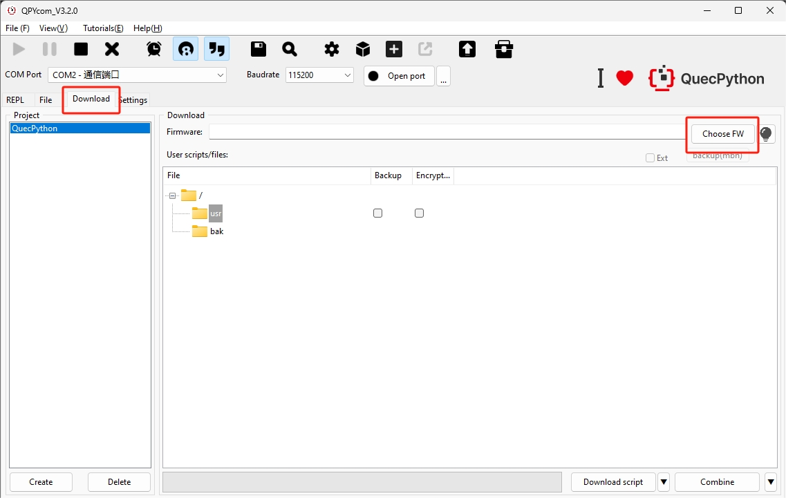

2. Download firmware

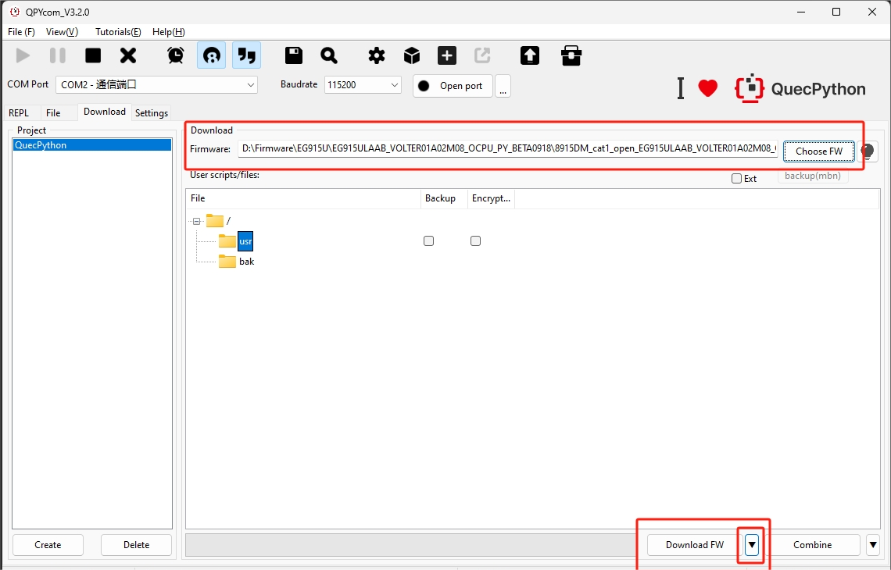

3. Wait for the completion of firmware download

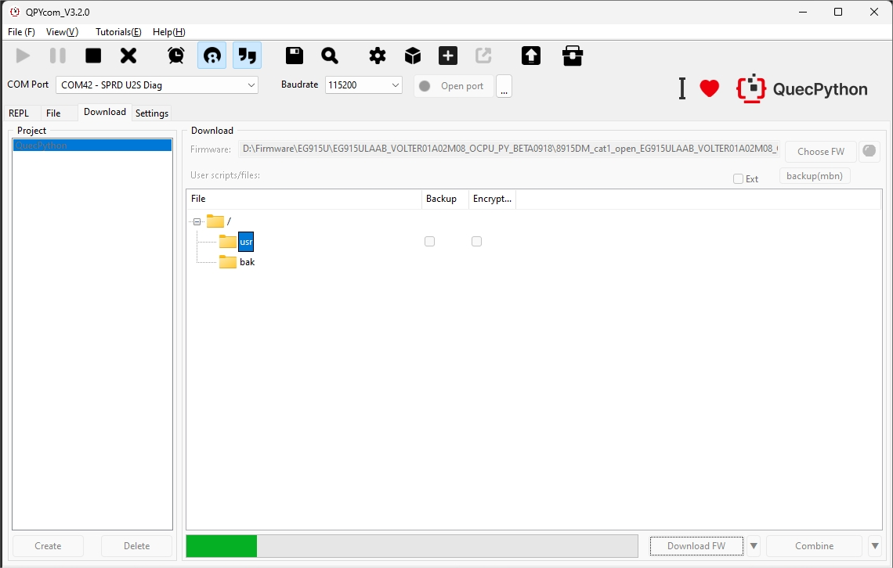

4. Successful download

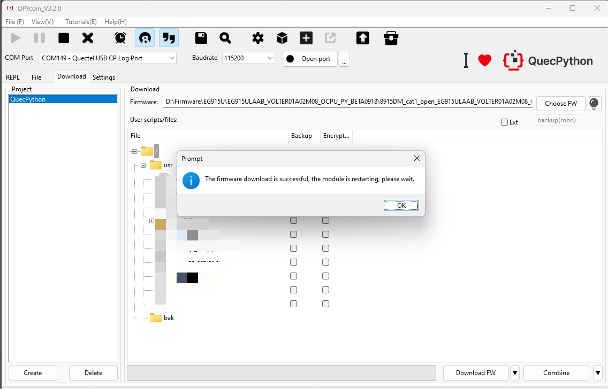

5. Connect to the interactive port

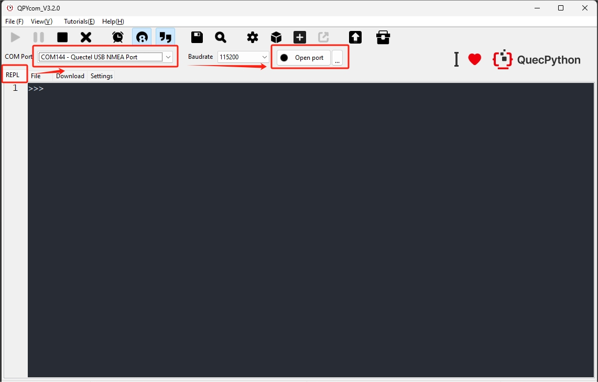

6. View the download information

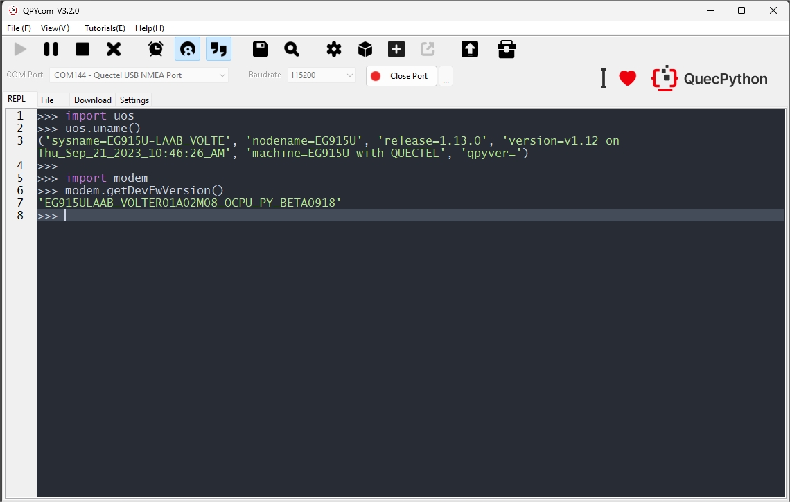

### Download Code

- When downloading the code via USB, you need to reserve a USB port or test point for the device. Or you can use an EVB for debugging, and install the driver in advance.

1. Select "**`Quectel USB NMEA PORT`**". This serial port is for interaction, and QPYcom logs will also be output through this serial port.

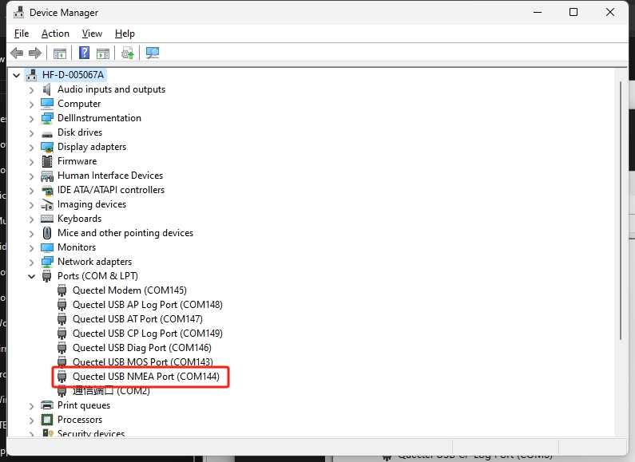

2. Download the business functional code to the device in batches. Click "**Download script**" and wait for the download to complete. After the download is complete, view the result on the "File" page.

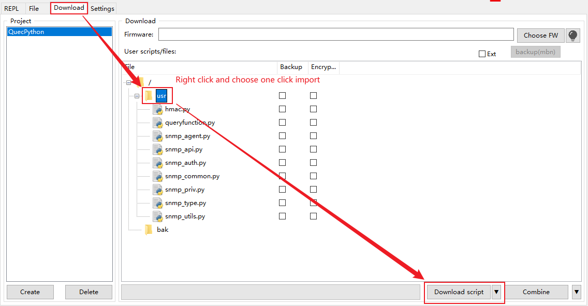

3. After successful download, it is recommended to reboot the device and run the function

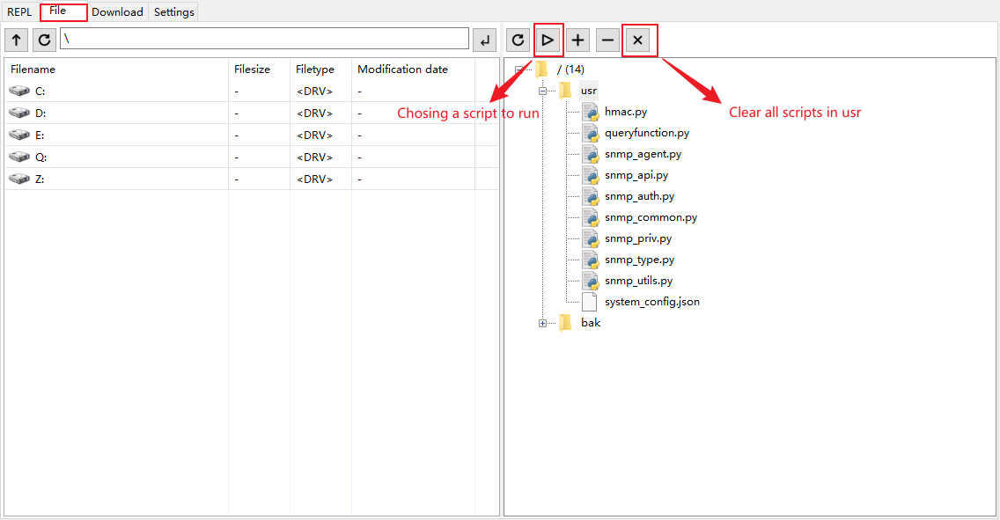

4. View the running result

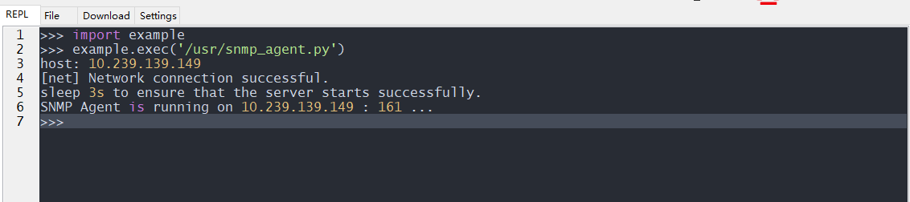

## Instructions

### 1.Burn firmware and scripts into the module

You can operate according to the environment construction chapter.

Specific steps can also refer to:

[Firmware burning - QuecPython (quectel.com)](https://python.quectel.com/doc/Getting_started/en/flash_firmware.html)

[Script burning - QuecPython (quectel.com)](https://python.quectel.com/doc/Getting_started/en/first_python.html)

### 2.Run snmp_agent_v3

The printed host is followed by the agent address "10.239.139.149".

```python
import example
example.exec('/usr/snmp_agent.py')
# host: 10.239.139.149
# [net] Network connection successful.
# sleep 3s to ensure that the server starts successfully.
# SNMP Agent is running on 10.239.139.149 : 161 ...
```

### 3.Create Client v3 object

1.The client side needs to establish a connection with the agent side, so the address needs to be the same, which is "10.239.139.149".

2.After establishing a connection, corresponding data can be transmitted using the client's get and set and the agent's trap.

```python
from usr.snmp_api import Client, V3
from usr.snmp_api import ObjectIdentifier as OID
from usr.snmp_api import OctetString
client = Client("10.239.139.149", V3("public"), port=161)
client.get("1.3.6.1.4.1.9999.1.1.7")
#Received SNMP request from data: b'0>\x02\x01\x030\x11\x02\x04f\xee\x9f\xa1\x02\x03\x01\x00\x01\x04\x01\x04\x02\x01\x03\x04\x100\x0e\x04\x00\x02\x01\x00\x02\x01\x00\x04\x00\x04\x00\x04\x000\x14\x04\x00\x04\x00\xa0\x0e\x02\x04f\xee\x9f\xa1\x02\x01\x00\x02\x01\x000\x00' datalen: 64 addr: ('10.239.139.149', 56584)
#new_value: b'' value_length: 0
#snmp_response: b'0S\x02\x01\x030\x11\x02\x04f\xee\x9f\xa1\x02\x03\x01\x00\x00\x04\x01\x00\x02\x01\x03\x04\x1f0\x1d\x04\x0f869487060565057\x02\x01\x00\x02\x01\x00\x04\x00\x04\x00\x04\x000\x1a\x04\x00\x04\x00\xa2\x14\x02\x04f\xee\x9f\xa1\x02\x01\x00\x02\x01\x000\x060\x04\x06\x00\x04\x00'
#Received SNMP request from data: b'0r\x02\x01\x030\x11\x02\x04f\xee\x9f\xa1\x02\x03\x01\x00\x01\x04\x01\x04\x02\x01\x03\x04%0#\x04\x0f869487060565057\x02\x01\x00\x02\x01\x00\x04\x06public\x04\x00\x04\x0003\x04\x0f869487060565057\x04\x00\xa0\x1e\x02\x04f\xee\x9f\xa1\x02\x01\x00\x02\x01\x000\x100\x0e\x06\n+\x06\x01\x04\x01\xce\x0f\x01\x01\x07\x05\x00' datalen: 116 addr: ('10.239.139.149', 56585)
#oid_values: Reboot readresult: 0 objresult: 0 value: False
#new_value: False value_length: 5
#snmp_response: b'0w\x02\x01\x030\x11\x02\x04f\xee\x9f\xa1\x02\x03\x01\x00\x00\x04\x01\x00\x02\x01\x03\x04%0#\x04\x0f869487060565057\x02\x01\x00\x02\x01\x00\x04\x06public\x04\x00\x04\x0008\x04\x0f869487060565057\x04\x00\xa2#\x02\x04f\xee\x9f\xa1\x02\x01\x00\x02\x01\x000\x150\x13\x06\n+\x06\x01\x04\x01\xce\x0f\x01\x01\x07\x04\x05False'
#GetResponse(1726914465, [VarBind(oid=ObjectIdentifier(value = 1.3.6.1.4.1.9999.1.1.7), value=OctetString(value = b'False'))])
client.set(OID("1.3.6.1.4.1.9999.1.1.7"), OctetString(b'False'))
#Received SNMP request from data: b'0w\x02\x01\x030\x11\x02\x04f\xee\x9f\xf3\x02\x03\x01\x00\x01\x04\x01\x00\x02\x01\x03\x04%0#\x04\x0f869487060565057\x02\x01\x00\x02\x01\x00\x04\x06public\x04\x00\x04\x0008\x04\x0f869487060565057\x04\x00\xa3#\x02\x04f\xee\x9f\xf3\x02\x01\x00\x02\x01\x000\x150\x13\x06\n+\x06\x01\x04\x01\xce\x0f\x01\x01\x07\x04\x05False' datalen: 121 addr: ('10.239.139.149', 56586)
#oid_values: Reboot readresult: 0 objresult: 0 value: 0
#new_value: b'False' value_length: 5
#snmp_response: b'0w\x02\x01\x030\x11\x02\x04f\xee\x9f\xf3\x02\x03\x01\x00\x00\x04\x01\x00\x02\x01\x03\x04%0#\x04\x0f869487060565057\x02\x01\x00\x02\x01\x00\x04\x06public\x04\x00\x04\x0008\x04\x0f869487060565057\x04\x00\xa2#\x02\x04f\xee\x9f\xf3\x02\x01\x00\x02\x01\x000\x150\x13\x06\n+\x06\x01\x04\x01\xce\x0f\x01\x01\x07\x04\x05False'
#OctetString(value = b'False')
agent.trigger_trap_event()
# SNMPv3 Trap sent to 192.168.1.100:162
```

## OID

Custom oids can be added to the `__init__` of the `SNPAgent` script within the `snmp.agent` script.

```python
self.oid_values = {
    '1.3.6.1.4.1.9999.1.1.7': 'Reboot',
    '1.3.6.1.4.1.9999.1.2.0': 'keepAliveDuration',
    '1.3.6.1.4.1.9999.1.3.2': 'Operator',
    '1.3.6.1.4.1.9999.1.4.0': 'APN',
    '1.3.6.1.4.1.9999.1.5.0': 'pwshute_en',
}
```

### client get

Just input the corresponding OID directly. For example:

```python
# Reboot
client.get("1.3.6.1.4.1.9999.1.1.7")
# keepAliveDuration
client.get("1.3.6.1.4.1.9999.1.2.0")
# Operator
client.get("1.3.6.1.4.1.9999.1.3.2")
# APN
client.get("1.3.6.1.4.1.9999.1.4.0")
# pwshute_en
client.get("1.3.6.1.4.1.9999.1.5.0")
```

### client set

The first parameter needs to be passed in with an OID object, and the second parameter needs to be passed in with the corresponding configuration using OctetString. For example:

```python
# Reboot Bool type, but transmission requires passing a string, False: Will not restart; True: Restart
client.set(OID("1.3.6.1.4.1.9999.1.1.7"), OctetString(b'False'))
# keepAliveDuration Int type, but transmission requires passing in a string, set the number of seconds to keep the connection active
client.set(OID("1.3.6.1.4.1.9999.1.2.0"), OctetString(b'0'))
# Operator Tuple type, no permission to set, transmission will fail
client.set(OID("1.3.6.1.4.1.9999.1.3.2"), OctetString(b'('CHN-UNICOM', 'UNICOM', '460', '01')'))
# APN Str type, just pass it in directly, set the APN information
client.set(OID("1.3.6.1.4.1.9999.1.4.0"), OctetString(b'3gnet,,'))
# pwshute_en Bool type, but transmission requires passing a string, False: Trap not enabled; True: Enable trap
client.set(OID("1.3.6.1.4.1.9999.1.5.0"), OctetString(b'False'))
```

### agent trap

```python
# Trap Event Triggered
agent.trigger_trap_event()
```

