# QuecPython SNMP 代理端使用文档

## 引言

本文档用于介绍如何在模组或设备上运行我们提供的snmp agent程序, 当前文档操作基于EG915U型号模组进行展示。

## 资源获取

资源下载地址: https://github.com/QuecPython/snmp

## 环境搭建

### USB驱动安装

请根据调试模组平台进行驱动下载安装, [点击此处下载](https://python.quectel.com/download)

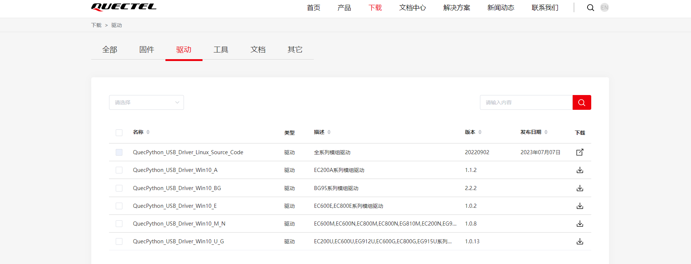

### 开发调试工具

推荐使用QPYcom进行开发调试, 此文档中的流程介绍均使用该工具进行, 且成功安装USB驱动

工具下载链接: [点击此处下载](https://python.quectel.com/download)

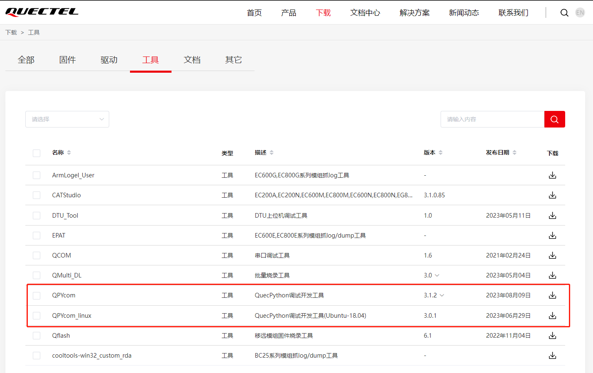

工具使用说明: [点击此处访问](https://python.quectel.com/doc/Application_guide/zh/dev-tools/QPYcom/index.html)

### 烧录固件

根据当前调试模组型号下载对应QuecPython固件, 并使用Qpycom工具进行烧录

固件下载地址: [点击此处访问](https://python.quectel.com/download)

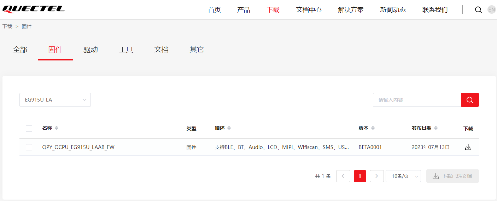

使用QPYcom工具下载固件

1. 选择固件

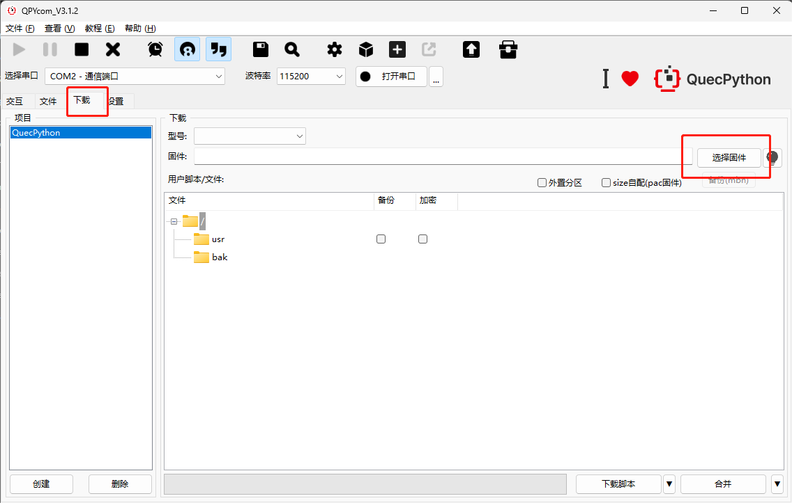

2. 下载固件

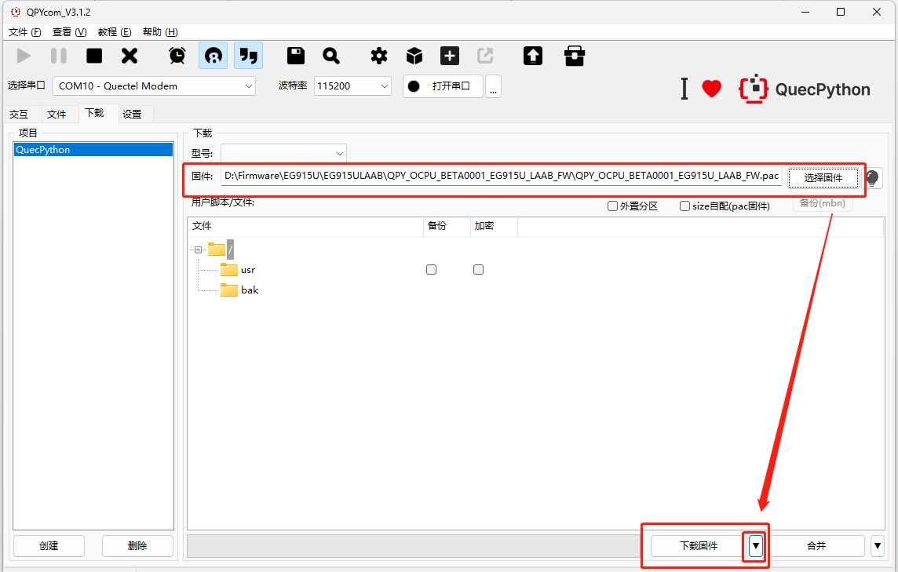

3. 等待固件烧录

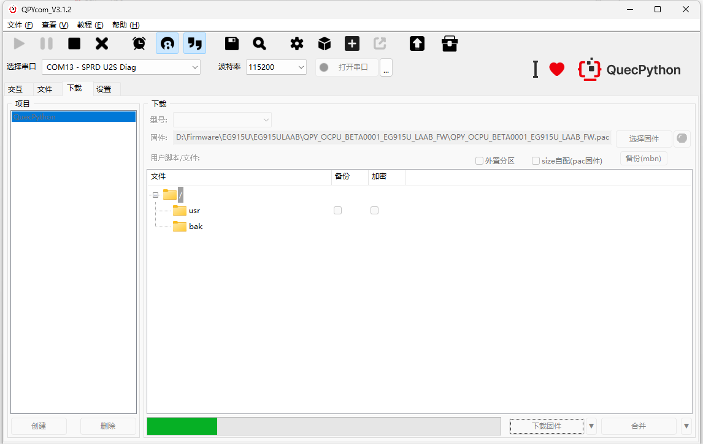

4. 烧录成功

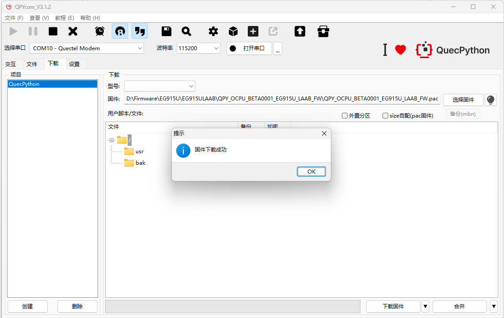

5. 连接交互口

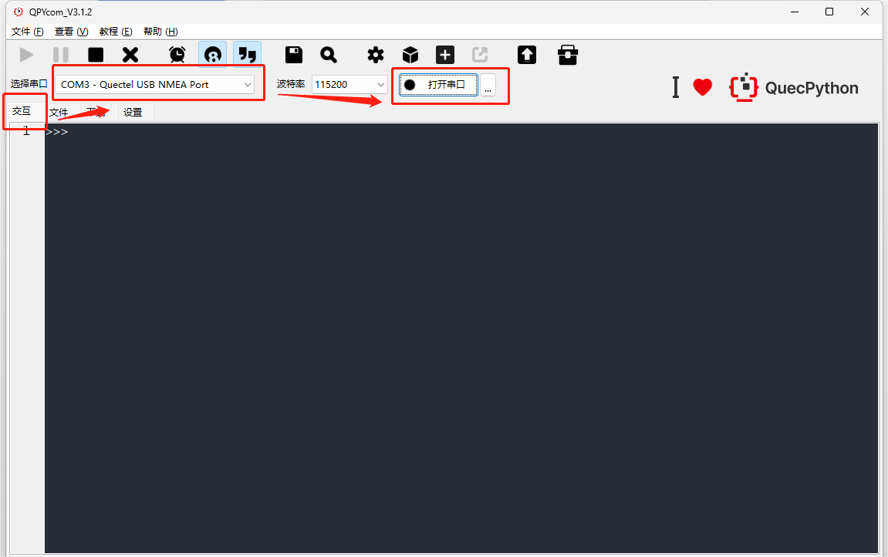

6. 查看烧录信息

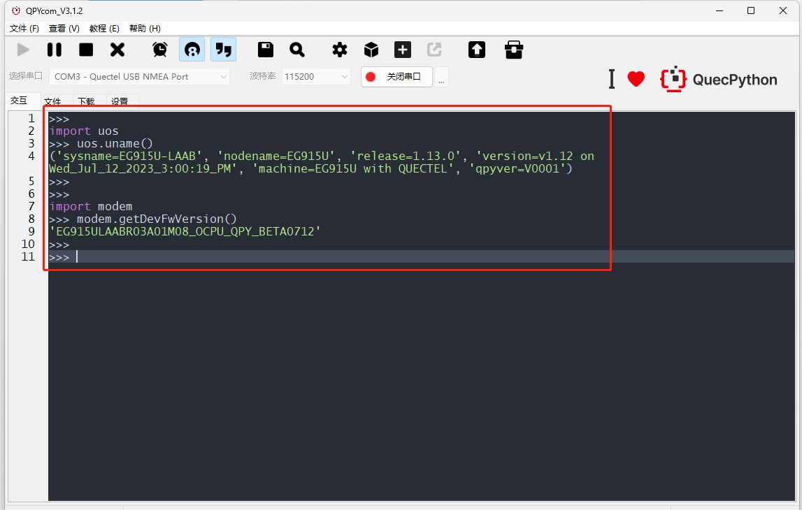

### 烧录代码

- 通过USB下载代码需要设备预留USB接口或测试点, 或使用开发板进行调试, 并提前安装好驱动

1. 选择`Quectel USB NMEA PORT`, 该串口为交互口, 程序LOG也会通过该串口输出

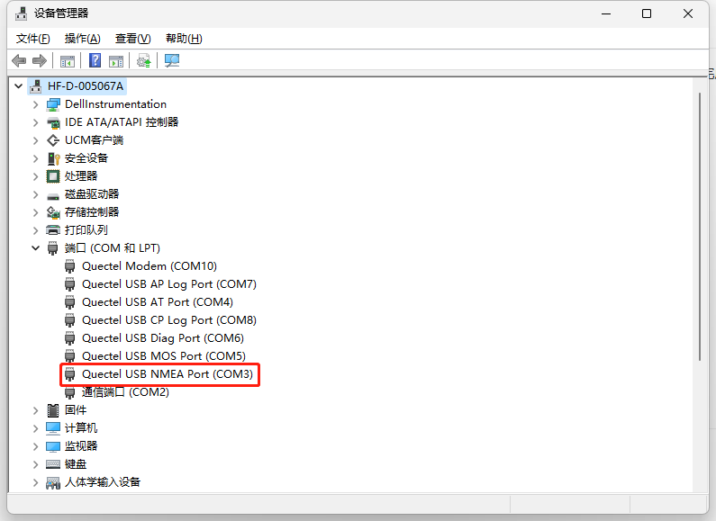

2. 将业务功能代码批量烧录设备, 点击下载脚本后等待下载完成, 下载完成后在文件中查看

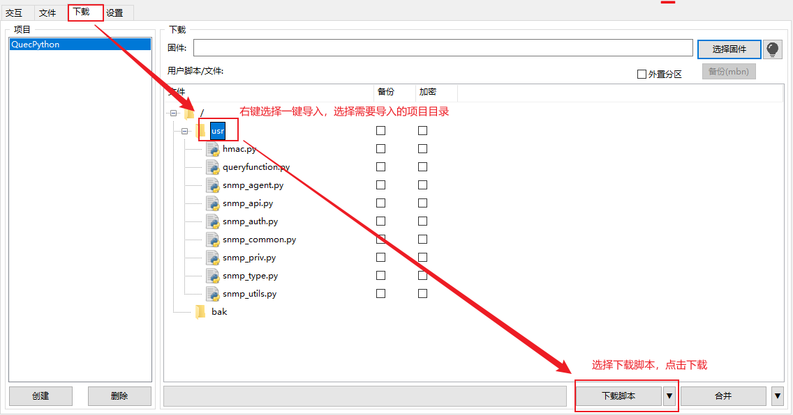

3. 烧录成功后建议重启设备, 然后运行功能

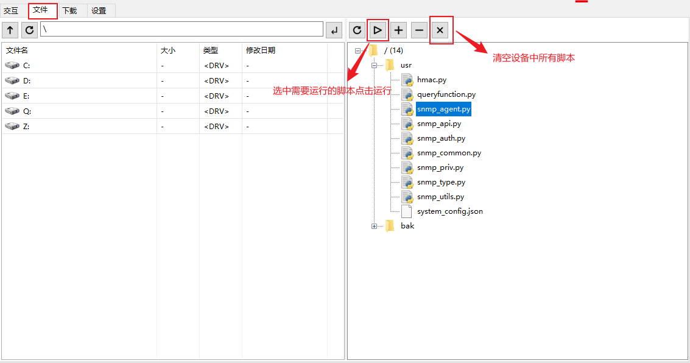

4. 运行结果展示

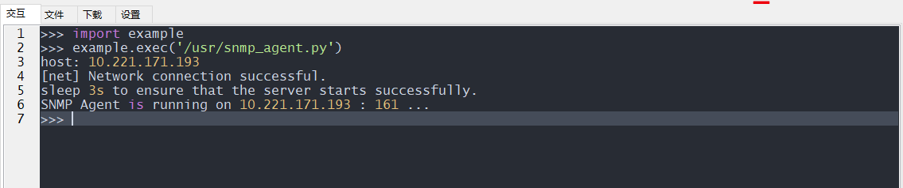

## 使用说明

### 1.将固件和脚本烧录到模组

可根据环境搭建章节进行操作。

具体步骤也可参照：

[固件烧录 - QuecPython (quectel.com)](https://python.quectel.com/doc/Getting_started/zh/flash_firmware.html)

[脚本烧录 - QuecPython (quectel.com)](https://python.quectel.com/doc/Getting_started/zh/first_python.html)

### 2.运行snmp_agent_v3

打印出来的host后面为agent端地址”10.221.171.193“。

```python
import example
example.exec('/usr/snmp_agent.py')
# host: 10.221.171.193
# [net] Network connection successful.
# sleep 3s to ensure that the server starts successfully.
# SNMP Agent is running on 10.221.171.193 : 161 ...
```

### 3.创建Client v3对象

1.client端需要与agent端建立连接，因此地址需要相同，为”10.221.171.193“。

2.建立连接后，可以使用client端的get、set与agent端的trap传输相应数据。

```python
from usr.snmp_api import Client, V3
from usr.snmp_api import ObjectIdentifier as OID
from usr.snmp_api import OctetString
client = Client("10.221.171.193", V3("public"), port=161)
client.get("1.3.6.1.4.1.9999.1.1.7")
#Received SNMP request from data: b'0>\x02\x01\x030\x11\x02\x04f\xee\x9f\xa1\x02\x03\x01\x00\x01\x04\x01\x04\x02\x01\x03\x04\x100\x0e\x04\x00\x02\x01\x00\x02\x01\x00\x04\x00\x04\x00\x04\x000\x14\x04\x00\x04\x00\xa0\x0e\x02\x04f\xee\x9f\xa1\x02\x01\x00\x02\x01\x000\x00' datalen: 64 addr: ('10.221.171.193', 56584)
#new_value: b'' value_length: 0
#snmp_response: b'0S\x02\x01\x030\x11\x02\x04f\xee\x9f\xa1\x02\x03\x01\x00\x00\x04\x01\x00\x02\x01\x03\x04\x1f0\x1d\x04\x0f869487060565057\x02\x01\x00\x02\x01\x00\x04\x00\x04\x00\x04\x000\x1a\x04\x00\x04\x00\xa2\x14\x02\x04f\xee\x9f\xa1\x02\x01\x00\x02\x01\x000\x060\x04\x06\x00\x04\x00'
#Received SNMP request from data: b'0r\x02\x01\x030\x11\x02\x04f\xee\x9f\xa1\x02\x03\x01\x00\x01\x04\x01\x04\x02\x01\x03\x04%0#\x04\x0f869487060565057\x02\x01\x00\x02\x01\x00\x04\x06public\x04\x00\x04\x0003\x04\x0f869487060565057\x04\x00\xa0\x1e\x02\x04f\xee\x9f\xa1\x02\x01\x00\x02\x01\x000\x100\x0e\x06\n+\x06\x01\x04\x01\xce\x0f\x01\x01\x07\x05\x00' datalen: 116 addr: ('10.221.171.193', 56585)
#oid_values: Reboot readresult: 0 objresult: 0 value: False
#new_value: False value_length: 5
#snmp_response: b'0w\x02\x01\x030\x11\x02\x04f\xee\x9f\xa1\x02\x03\x01\x00\x00\x04\x01\x00\x02\x01\x03\x04%0#\x04\x0f869487060565057\x02\x01\x00\x02\x01\x00\x04\x06public\x04\x00\x04\x0008\x04\x0f869487060565057\x04\x00\xa2#\x02\x04f\xee\x9f\xa1\x02\x01\x00\x02\x01\x000\x150\x13\x06\n+\x06\x01\x04\x01\xce\x0f\x01\x01\x07\x04\x05False'
#GetResponse(1726914465, [VarBind(oid=ObjectIdentifier(value = 1.3.6.1.4.1.9999.1.1.7), value=OctetString(value = b'False'))])
client.set(OID("1.3.6.1.4.1.9999.1.1.7"), OctetString(b'False'))
#Received SNMP request from data: b'0w\x02\x01\x030\x11\x02\x04f\xee\x9f\xf3\x02\x03\x01\x00\x01\x04\x01\x00\x02\x01\x03\x04%0#\x04\x0f869487060565057\x02\x01\x00\x02\x01\x00\x04\x06public\x04\x00\x04\x0008\x04\x0f869487060565057\x04\x00\xa3#\x02\x04f\xee\x9f\xf3\x02\x01\x00\x02\x01\x000\x150\x13\x06\n+\x06\x01\x04\x01\xce\x0f\x01\x01\x07\x04\x05False' datalen: 121 addr: ('10.221.171.193', 56586)
#oid_values: Reboot readresult: 0 objresult: 0 value: 0
#new_value: b'False' value_length: 5
#snmp_response: b'0w\x02\x01\x030\x11\x02\x04f\xee\x9f\xf3\x02\x03\x01\x00\x00\x04\x01\x00\x02\x01\x03\x04%0#\x04\x0f869487060565057\x02\x01\x00\x02\x01\x00\x04\x06public\x04\x00\x04\x0008\x04\x0f869487060565057\x04\x00\xa2#\x02\x04f\xee\x9f\xf3\x02\x01\x00\x02\x01\x000\x150\x13\x06\n+\x06\x01\x04\x01\xce\x0f\x01\x01\x07\x04\x05False'
#OctetString(value = b'False')
agent.trigger_trap_event()
# SNMPv3 Trap sent to 192.168.1.100:162
```

## OID

在`snmp_agent`脚本内`SNMPAgent`的`__init__`可以添加自定义oid。

```python
self.oid_values = {
    '1.3.6.1.4.1.9999.1.1.7': 'Reboot',
    '1.3.6.1.4.1.9999.1.2.0': 'keepAliveDuration',
    '1.3.6.1.4.1.9999.1.3.2': 'Operator',
    '1.3.6.1.4.1.9999.1.4.0': 'APN',
    '1.3.6.1.4.1.9999.1.5.0': 'pwshute_en',
}
```

### client get

直接传入对应oid即可。例如：

```python
# Reboot
client.get("1.3.6.1.4.1.9999.1.1.7")
# keepAliveDuration
client.get("1.3.6.1.4.1.9999.1.2.0")
# Operator
client.get("1.3.6.1.4.1.9999.1.3.2")
# APN
client.get("1.3.6.1.4.1.9999.1.4.0")
# pwshute_en
client.get("1.3.6.1.4.1.9999.1.5.0")
```

### client set

第一个参数需要使用OID对象传入oid，第二个参数需要使用OctetString传入对应配置。例如：

```python
# Reboot bool类型，但传输需要传入字符串，False：不会重启；True：重启
client.set(OID("1.3.6.1.4.1.9999.1.1.7"), OctetString(b'False'))
# keepAliveDuration int类型，但传输需要传入字符串，设置保持连接活动的秒数
client.set(OID("1.3.6.1.4.1.9999.1.2.0"), OctetString(b'0'))
# Operator tuple类型，无设置权限，会传输失败
client.set(OID("1.3.6.1.4.1.9999.1.3.2"), OctetString(b'('CHN-UNICOM', 'UNICOM', '460', '01')'))
# APN str类型，直接传入即可，设置apn信息
client.set(OID("1.3.6.1.4.1.9999.1.4.0"), OctetString(b'3gnet,,'))
# pwshute_en bool类型，但传输需要传入字符串，False：不启用trap；True：启用trap
client.set(OID("1.3.6.1.4.1.9999.1.5.0"), OctetString(b'False'))
```

### agent trap

```python
# Trap Event Triggered
agent.trigger_trap_event()
```

